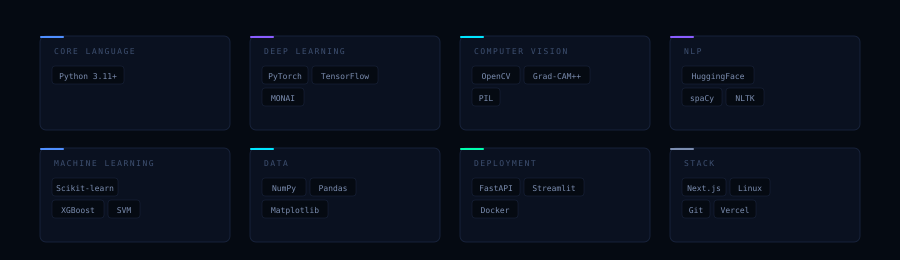

  

> CS&amp;E graduate (2026) working on machine learning and applied AI. Interned at **DRDO** on radar signal classification and at **IIIT Hyderabad** on Telugu NLP corpus development. Building projects across computer vision, NLP, and deep learning — from training to deployment.

<!--
================================================================
  TIMELINE
================================================================
-->

<!--
================================================================
  INTERNSHIPS
================================================================
-->

<b>INTERNSHIPS</b>

**ML Intern — DRDO, Hyderabad** &nbsp;`2023`

**Problem**

Operational radar systems generate false detections due to electronic countermeasure (ECM) jamming. These false targets degrade situational awareness and can lead to critical decision errors in defense scenarios. A reliable automated system was needed to distinguish genuine radar returns from manufactured interference.

**Responsibilities**

- Analyzed raw radar return data and designed feature extraction pipelines for time-domain signal characteristics
- Engineered discriminative features including signal energy, pulse width distribution, Doppler spread, and spectral signatures
- Trained and evaluated ensemble classifiers — XGBoost, Random Forest, SVM — on labeled defense-grade datasets
- Iteratively improved model generalization through cross-validation and threshold tuning

**Outcome**

- Achieved high-precision binary classification of radar targets vs. false ECM-induced detections
- Delivered a reproducible ML pipeline suitable for integration into signal processing workflows
- Produced interpretable feature importance rankings enabling domain expert validation

`Signal Processing` &nbsp; `XGBoost` &nbsp; `Random Forest` &nbsp; `SVM` &nbsp; `Feature Engineering` &nbsp; `Scikit-learn` &nbsp; `NumPy`

**NLP Intern — IIIT Hyderabad** &nbsp;`2022`

**Problem**

South Indian languages like Telugu are critically under-resourced in NLP. The absence of large, high-quality annotated corpora prevents training of robust language models for over 82 million native speakers.

**Responsibilities**

- Contributed to structured Telugu NLP dataset design and curation for low-resource language modelling
- Performed manual linguistic annotation across morphological, syntactic, and semantic dimensions
- Worked under supervision to ensure annotation consistency and inter-annotator agreement
- Helped build corpus pipelines for text normalization, tokenization, and structured data storage

**Outcome**

- Produced annotated linguistic data contributing to Telugu language model infrastructure
- Corpus resources support downstream NLP tasks: POS tagging, NER, parsing, and text classification

`Low-Resource NLP` &nbsp; `Dataset Annotation` &nbsp; `Corpus Construction` &nbsp; `Telugu Language` &nbsp; `Linguistic Annotation`

<!--
================================================================
  PROJECTS
================================================================
-->

<b>FEATURED PROJECTS</b>

**Brain Tumor Detection &amp; Segmentation** &nbsp;·&nbsp; Medical Imaging · 3D Deep Learning · Explainable AI

**Problem**

Brain tumor segmentation from multi-modal MRI is inherently complex: tumors exhibit high variability in shape, size, and appearance across T1, T2, FLAIR, and T1ce modalities. Clinical deployment further requires model predictions to be interpretable by radiologists — not just accurate.

**Solution**

A 3D Residual Attention U-Net trained on the BraTS 2020 benchmark dataset for multi-class segmentation of enhancing tumor, tumor core, and whole tumor regions across four MRI modalities. Grad-CAM++ saliency maps provide region-level visual explanations, and a Streamlit dashboard surfaces model output in a clinical interface.

**Pipeline**

`MRI Input` → `MONAI Preprocessing` → `3D Res-Attn U-Net` → `Multi-class Segmentation` → `Grad-CAM++ Explainability` → `Streamlit Dashboard`

**Challenges**

- Class imbalance between tumor sub-regions and healthy tissue across 3D volumes
- Maintaining spatial context across all three dimensions with efficient GPU memory usage
- Making model predictions legible to clinical users without deep ML expertise

**Outcome**

- Strong Dice scores across tumor sub-regions on BraTS 2020 validation split
- Explainability layer enabling verification of model predictions
- End-to-end deployable system from raw MRI DICOM to annotated segmentation output

`PyTorch` &nbsp; `3D U-Net` &nbsp; `Residual Attention` &nbsp; `Grad-CAM++` &nbsp; `BraTS 2020` &nbsp; `MONAI` &nbsp; `Streamlit`

**Radar False Target Detection** &nbsp;·&nbsp; Defense ML · Signal Intelligence · Ensemble Classifiers

**Problem**

Modern radar systems face sophisticated electronic countermeasures that inject synthetic false targets — ghost echoes — into the return signal. Without automated discrimination, operators face an overwhelming volume of alerts, compromising response time and mission effectiveness.

**Solution**

An ML classification pipeline that ingests raw radar return data, applies targeted feature engineering at the signal processing level, and deploys an ensemble of classifiers (XGBoost, Random Forest, SVM) to distinguish genuine targets from ECM-induced false detections.

**Pipeline**

`Radar Signal Data` → `Signal Processing` → `Feature Engineering` → `Ensemble Classifiers` → `Binary Classification Output`

**Technologies**

`XGBoost` &nbsp; `Random Forest` &nbsp; `SVM` &nbsp; `Scikit-learn` &nbsp; `NumPy` &nbsp; `Signal Processing`

**Outcome**

- High-accuracy binary classification of radar targets vs. false ECM returns
- Interpretable feature importances enabling validation by domain experts
- Modular pipeline architecture suitable for real-time integration

<i>Repository not publicly available — developed during DRDO internship on classified datasets.</i>

**Telugu LLM — Chandamama Kathalu** &nbsp;·&nbsp; NLP · LLM · Telugu Language

**Overview**

Building a language model trained on Chandamama Kathalu, a classic Telugu children's stories corpus. The project focuses on low-resource language modeling for Telugu — a language with limited NLP tooling — using a domain-specific text corpus.

**Pipeline**

`Data Collection` → `Text Preprocessing` → `Custom Tokenization` → `Model Training` → `Telugu Text Generation`

**Approach**

- Curated and preprocessed Chandamama Kathalu stories as the training corpus
- Built a custom Telugu tokenizer suited to the script and morphology
- Trained a language model for text generation and story completion

`Python` &nbsp; `HuggingFace` &nbsp; `PyTorch` &nbsp; `Transformers` &nbsp; `Telugu NLP` &nbsp; `Tokenization`

<!--
================================================================
  TECH STACK
================================================================
-->

<b>TECHNICAL ECOSYSTEM</b>

<!--
================================================================
  CONTACT
================================================================
-->

<b>GET IN TOUCH</b>

